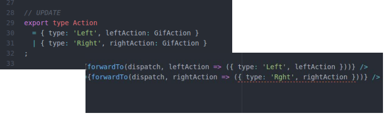

# [The Elm Architecture](https://github.com/evancz/elm-architecture-tutorial) in Redux, statically checked using [flow](https://flowtype.org/)

Atempt to be as close as possible to Elm Architecutre in means of composition and static typing, and not lose Redux good parts (devtools) in the process.

## Static typing
Following parts are statically type checked with flow:

1. init and update functions input and result
2. view props
3. action creation, both on view events and effects results (tagged action creation is also checked, when composing views and effects). This is achieved with [disjoint union](https://flowtype.org/docs/disjoint-unions.html#_)



## Effect handling
Slight variation implemented on top of [redux-loop](https://github.com/raisemarketplace/redux-loop), so it can be statically type-checked.

## Devtools
Full hot reload and time travel compatibility. Keeping it that way is of **high priority**

*TODO: Tagged actions pretty print*

## How to use?
Please check the famous Elm nesting [examples](./examples)

## Package?
At the moment this is just an experiment, so if you would like to play with [examples](./examples) use [npm link](http://justjs.com/posts/npm-link-developing-your-own-npm-modules-without-tears):

```
npm run build:lib
npm link
/examples/pair-of-counters/ npm link redux-elmish
```
